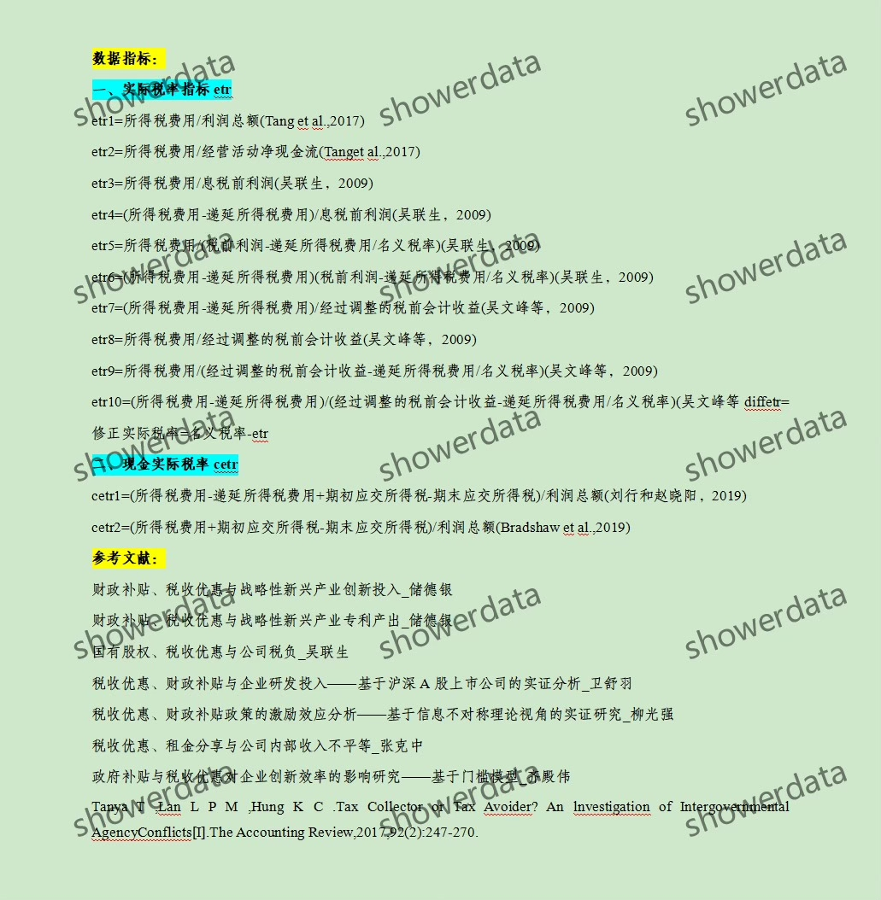
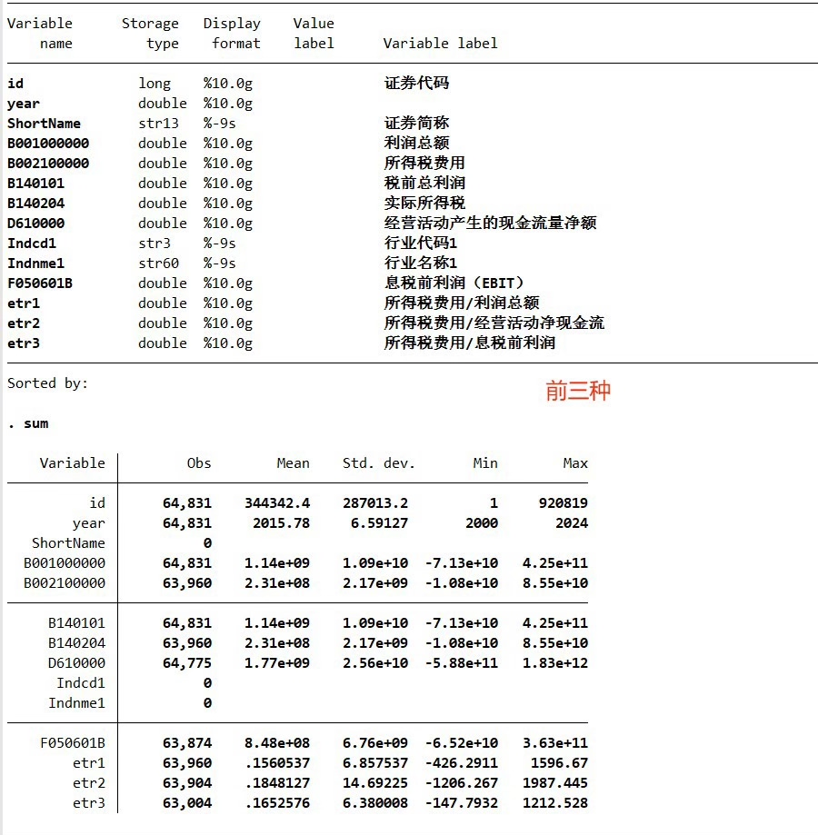
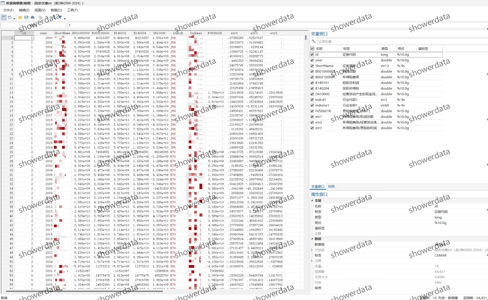
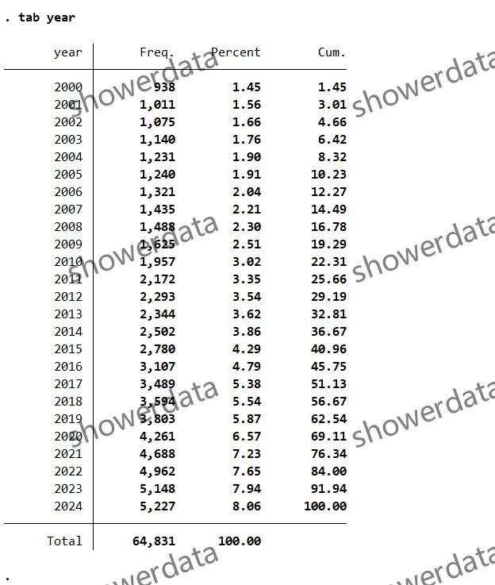
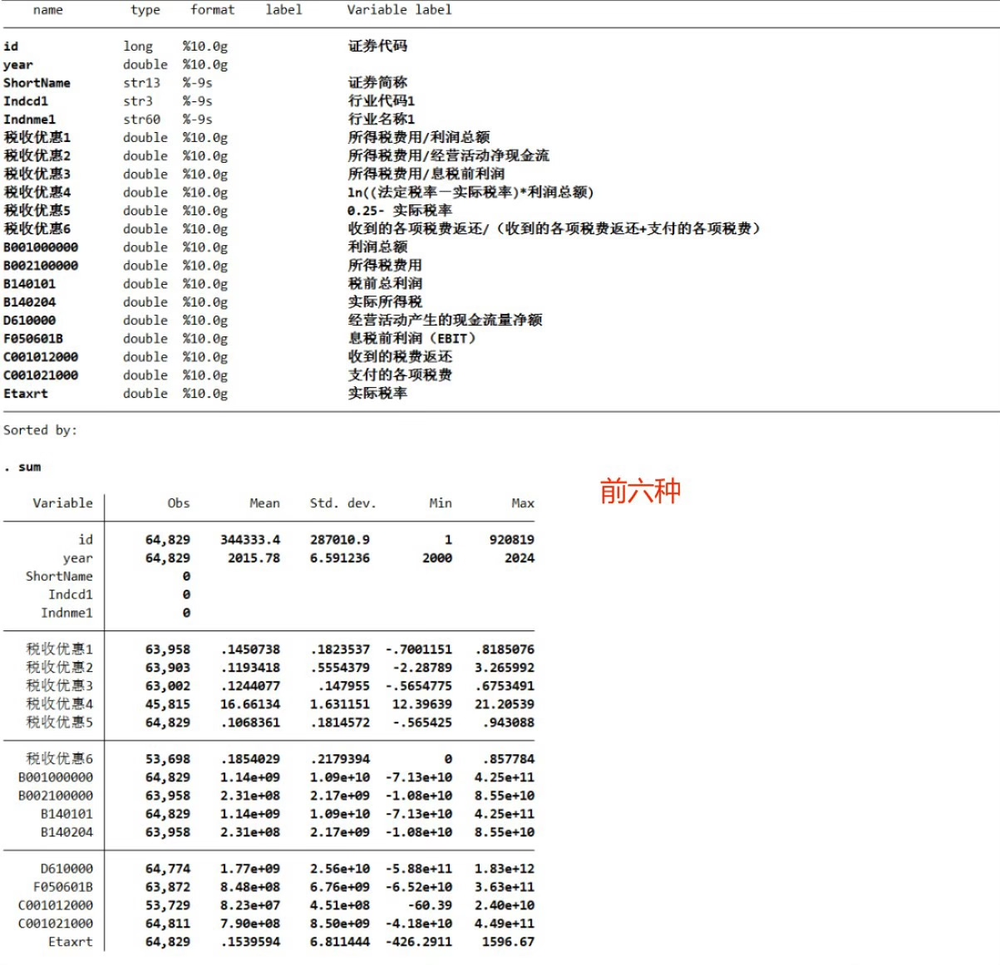
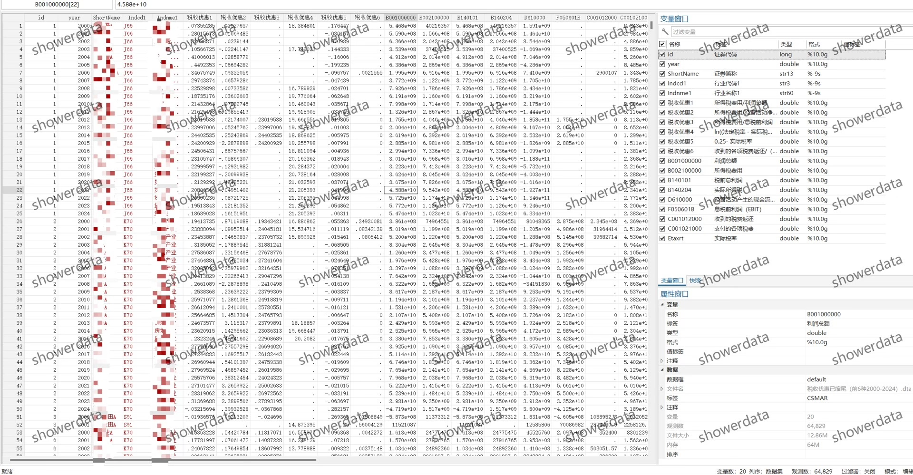
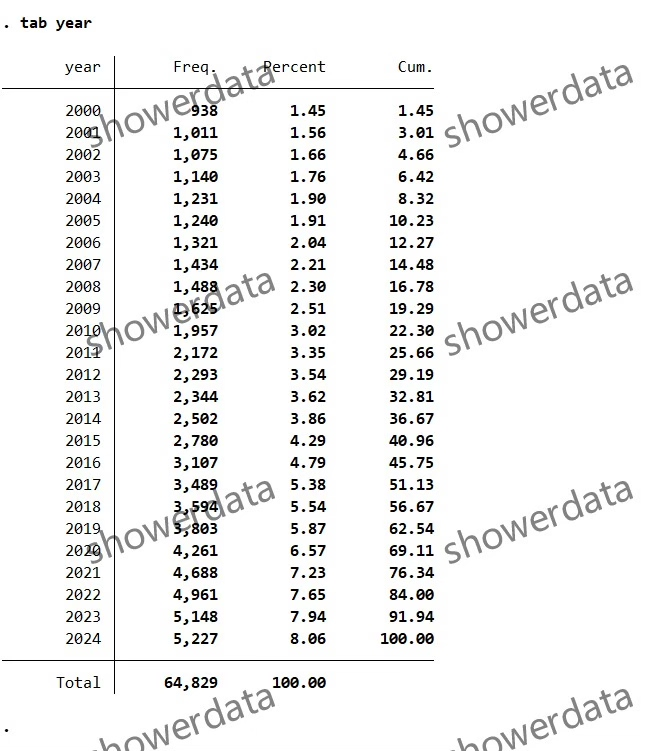
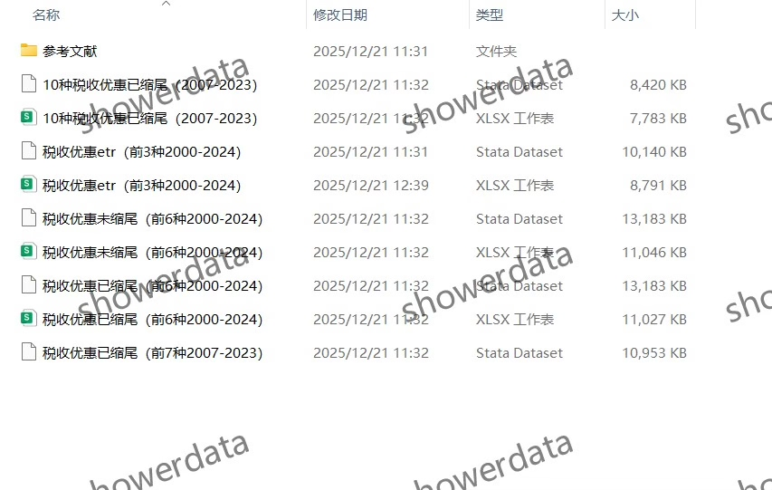

## Body

（2000-2024年）上市公司-实际所得税税率（ETR）

ps.无cetr！
一、数据介绍
（1）数据详情：见下方图片，拍前请看清楚！已完整展示说明，请确定好是不是自己需要的再拍下！发货后任何理由不退不换！
（2）数据名称：上市公司-实际所得税税率（ETR）
（3）样本范围：A鼓尚视公司
前三种ETR（2000-2024）：共6.4w+观测值，见图，展示结果为未缩尾，未缩尾一个版本
前六种ETR（2000-2024）：共6.4w+条观测值，见图，展示结果为已缩尾，有已缩尾未缩尾两种版本
十种（2007-2023）：共3.3w+条观测值，见图，展示结果为未缩尾，未缩尾一个版本
（4）时间范围：2000-2024年6种指标，2007-2023有10种指标
（5）结果数据格式：dta、excel
（6）数据内容：结果、参考文献、原始数据（英文文献需自己下载、无代码、介意勿拍）
（7）原始数据来源：CS。MAR

二、数据结果指标如图所示

三、计算方法如图所示

四、参考文献如图所示

## Images

Here is a pay link on Stripe ( https://buy.stripe.com/3cs8yP7sY87d0vu9AB ). Please contact me lonlonago@foxmail.com after funding $89, and I will send you a complete data files , thank you!

